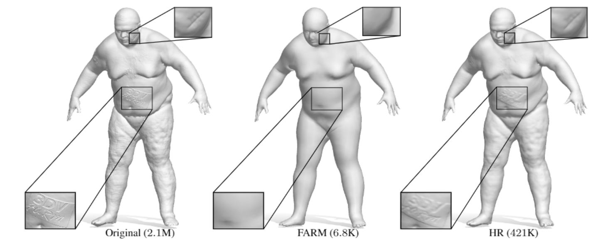

# FARM
Marin, R. and Melzi, S. and Rodolà, E. and Castellani, U., High-Resolution Augmentation for Automatic Template-Based Matching of Human Models, 3DV 2019

  
## Contents
* [Quick-start](https://github.com/riccardomarin/FARM-ZOSR#Quick-start)

## Quick-start
The code runs will be available soon.
